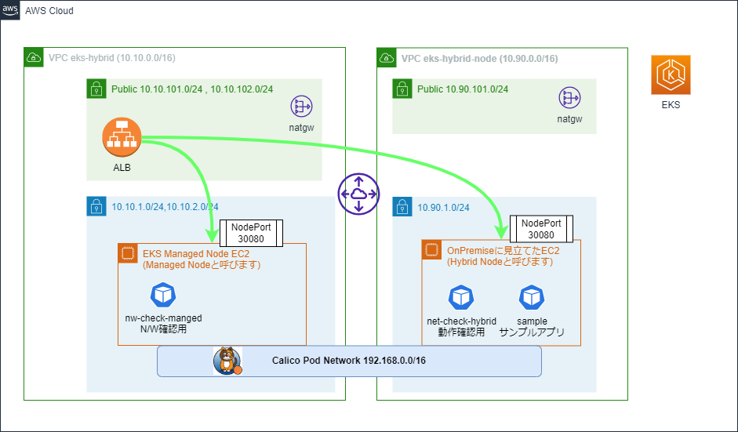

# EKS Hybrid NodesをCalicoで使ってみたサンプル

- [EKS Hybrid NodesをCalico使って構成してみた](https://www.beex-inc.com/blog/eks-hybrid-nodes-calico)


### Deploy

```sh
make tf-apply-aws
```

### Destroy

```sh
make tf-destroy-aws
```

### 構成図



